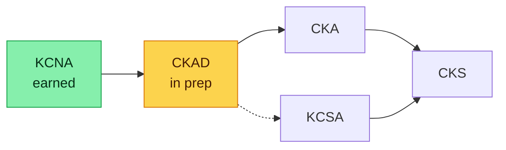
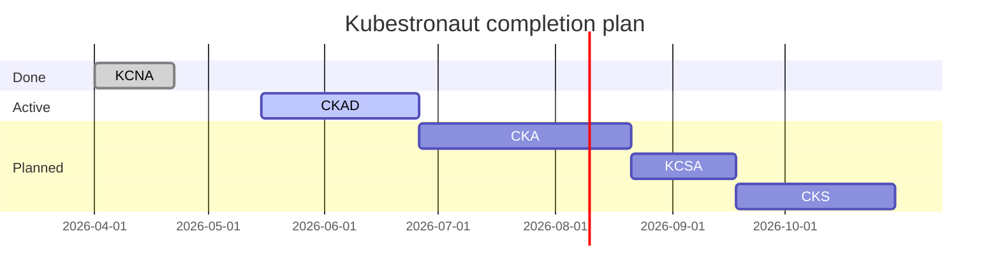

# Kubestronaut path

**Kubestronaut** is the CNCF's recognition for holding all five active Kubernetes certifications. Earning it gets you a digital badge, physical swag (the jacket is real), and — more usefully — comprehensive operational knowledge that spans dev, admin, and security.

I currently hold **1/5**. This page is the running plan to finish the rest.

## The five certifications



| Cert | Audience | Format | Time | Cost (2026) |
| ---- | -------- | ------ | ---- | ----------- |
| **KCNA** | Anyone | Multiple choice | 90 min | $250 |
| **KCSA** | Security-curious | Multiple choice | 90 min | $250 |
| **CKAD** | App developers | Hands-on lab | 2 hours | $445 |
| **CKA** | Platform / SRE | Hands-on lab | 2 hours | $445 |
| **CKS** | Security engineers | Hands-on lab | 2 hours | $445 (requires CKA) |
| **Total** |  |  |  | **$1,840** |

:::tip[CNCF coupon codes]
The Linux Foundation runs **40–50% off sales** several times a year (Black Friday, KubeCon weeks, Cyber Monday). Wait for one. The math goes from $1,840 to under $1,000.
:::

:::warning[Each exam has its own free retake — once]
Every CNCF exam includes one free retake within 12 months of your first attempt. Use that as a safety net, but don't plan around it. People who pass on the first try took the simulator seriously.
:::

:::info[Lab environment in 2026]
All hands-on CNCF exams now run inside a remote PSI browser session — your local clipboard works, but copy-paste between the browser and your local IDE does not. Practice typing YAML in `vim` and `kubectl create --dry-run=client -o yaml` to generate manifests. Muscle memory is the difference between passing and timing out.
:::

## The order I'm taking them

### 1. KCNA (Kubernetes and Cloud Native Associate) — earned

Easy entry. Multiple choice, fundamentals. Worth doing because it forces you to learn the CNCF landscape (not just k8s — also service mesh, observability, runtime, etc.).

**Time invested**: ~3 weeks at 1 hour/day.
**Resource**: KodeKloud's KCNA course + the official curriculum doc.

### 2. CKAD (Application Developer) — in active prep

I'm taking this **before** CKA because:

- It tests **manifest skills** — Pods, Deployments, Services, ConfigMaps, Secrets — which I use constantly already
- Lab format is more forgiving than CKA (less networking, more app config)
- Earning it builds `kubectl` muscle memory that makes CKA's harder topics easier

**Target date**: ~6 weeks from now.
**Resource**: KodeKloud labs + the [official curriculum](https://github.com/cncf/curriculum).

### 3. CKA (Administrator)

The flagship. Tests cluster lifecycle, networking, troubleshooting, upgrades.

**Plan**: 8 weeks of prep after CKAD. The overlap with CKAD knowledge cuts this roughly in half.

### 4. KCSA (Security Associate)

Second associate. Multiple-choice, security-focused. I'm taking it between CKA and CKS as a primer for the much-harder CKS.

### 5. CKS (Security Specialist)

Hardest of the five. Requires CKA as a prerequisite. Hands-on lab on a tight clock. Covers everything from `falco` to admission controllers to image scanning to runtime security.

**Plan**: 6 weeks of prep after KCSA.

## Estimated total time

If I stay on schedule:



Target Kubestronaut completion: **end of 2026**.

## Study setup

<Tabs groupId="study-setup">
  <TabItem value="env" label="Environment" default>
    For lab-format exams (CKAD, CKA, CKS) I practice on my homelab cluster — same K3s version as the exam (or pinned to the closest match). Real clusters force you past the "in theory this works" hump.

    Backup: [Killer.sh](https://killer.sh) gives you 2 simulator sessions per exam purchase. Use them.
  </TabItem>
  <TabItem value="tooling" label="Tooling">
    - **`kubectl` alias**: `alias k=kubectl` is allowed in-exam. Use it.
    - **`vim` config**: a minimal `~/.vimrc` is allowed. Set indentation:
      ```vim
      set ts=2 sw=2 et
      ```
    - **`kubectl` completion**: enabled by default in the exam environment.
    - **`bash` aliases**: `alias kn='kubectl config set-context --current --namespace'` saves a lot of typing.
  </TabItem>
  <TabItem value="resources" label="Resources">
    | Resource | Format | Cost | Comment |
    | --- | --- | --- | --- |
    | KodeKloud | Video + labs | $30/mo | My main resource |
    | Killer.sh | Simulator | Included in exam fee | Use both sessions |
    | Official curriculum | PDF | Free | The exam blueprint |
    | "Kubernetes Up & Running" | Book | ~$40 | Reference, not study |
    | r/kubernetes | Subreddit | Free | Day-of tips |
  </TabItem>
</Tabs>

## Updates

I'll update this page after each exam with:

- Exam day notes (gotchas, timing, environment quirks)
- What I'd do differently
- Links to per-cert study guides

Subscribe via the [feed](/rss.xml) (coming soon — for now just check back).
