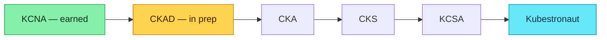

# Certification guides

Field-tested study notes for the certifications I've earned and the ones I'm working toward right now. Each guide assumes you're working a full-time job and don't have unlimited prep time.

## What I've earned

| Cert                                  | Year | Difficulty       | Worth it? |
| ------------------------------------- | ---- | ---------------- | --------- |
| **AWS Certified Solutions Architect** | 2025 | ★★★☆☆            | Yes — the cloud lingua franca |
| **HashiCorp Terraform Associate 004** | 2026 | ★★★☆☆            | Yes — forces HCL fluency |
| **Kubernetes & Cloud Native Associate (KCNA)** | 2026 | ★★☆☆☆ | Yes — Kubestronaut step 1 |
| **RHCSA (v9)**                        | 2024 | ★★★★☆            | Yes — best Linux fundamentals exam |
| **RHCE**                              | 2024 | ★★★★☆            | Yes — Ansible mastery validation |
| **Dynatrace Associate**               | 2023 | ★★☆☆☆            | Vendor-specific; only if you use Dynatrace |
| **GitLab Migration Specialist**       | 2022 | ★★☆☆☆            | Niche; useful if migrating from GitHub |
| **GitLab Services Engineer Pro**      | 2022 | ★★☆☆☆            | Vendor-specific |
| **GitLab CI/CD Associate**            | 2021 | ★★☆☆☆            | Yes if you live in GitLab CI |
| **GitLab Implementation Specialist**  | 2022 | ★★☆☆☆            | Vendor-specific |
| **Accredited Partner Technical Engineer** | 2023 | ★★☆☆☆        | Generic partner cert |

## What I'm working on now

The **Kubestronaut** path is 5 CNCF certifications. Earning all five gets you the Kubestronaut badge, exclusive swag, and (more usefully) genuine end-to-end Kubernetes operational knowledge — admin, dev, security, and observability.

I'm 1/5. Read the [Kubestronaut path guide](/certifications/kubestronaut) for the order I'm tackling them and why.

## Where I keep the guides

Currently published:

- [**Kubestronaut path overview**](/certifications/kubestronaut) — strategy, order, study plan

In progress (drafts will appear here):

- HashiCorp Terraform Associate (HCTA-004)
- RHCSA v9
- RHCE
- CKAD (in active prep)

## How my guides are structured

Each guide follows the same shape so you can navigate fast:

1. **What this cert actually tests** — the real exam, not the marketing page
2. **Prerequisites** — what you need before sitting down
3. **Study plan** — 4–8 week schedule with daily ~2 hours
4. **Domain breakdown** — every exam domain with the resource I used
5. **Practice strategy** — which labs / which mock exams
6. **Exam day** — environment, gotchas, time budget per question
7. **What I'd do differently** — written after taking the exam

:::tip[Cert dumps don't work]
Every certification body now has aggressive anti-cheating. The exams in 2026 are mostly hands-on labs (CKAD, RHCSA, RHCE) or scenario questions that punish trivia recall. Learn the material. Use the certifications as deadlines, not the destination.
:::

:::warning[Read the exam handbook before scheduling]
Every cert body publishes an exam handbook with the testing environment rules. Camera positioning, allowed snacks, whether you can leave the room — they vary. Skipping the handbook is how proctoring violations happen.
:::

:::info[On retakes]
Almost every cert lets you retake within 12 months for a discount (typically 50% off). If you're on the fence about sitting an exam, schedule it anyway — the deadline pressure is worth more than the retake fee.
:::
