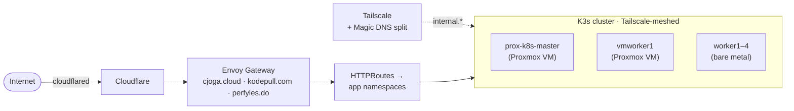

# Lab overview

The site you're reading runs on a [K3s](https://k3s.io/) cluster I run myself — six nodes split between a [Proxmox](https://www.proxmox.com/) host and a handful of bare-metal machines, meshed over [Tailscale](https://tailscale.com/), with [Envoy Gateway](https://gateway.envoyproxy.io/) in front and a [Cloudflare Tunnel](https://www.cloudflare.com/products/tunnel/) handling the public edge. It hosts `cjoga.cloud`, `blog.cjoga.cloud`, `kodepull.com`, `perfyles.do`, and roughly a dozen other projects I run for myself or for [KODEPULL](/engineering/work/kodepull).

The interesting part isn't what's running on it today. It's how it got here.

## How it's wired today

Six nodes: one K3s control-plane node living as a Proxmox VM (`prox-k8s-master`), one second VM worker on the same Proxmox host, and four bare-metal workers on a wired LAN. Storage is [Longhorn](https://longhorn.io/). Secrets are [OpenBao](https://openbao.org/) — the FOSS Vault fork — fronted by [External Secrets Operator](https://external-secrets.io/) so apps consume Kubernetes secrets without ever touching the bao directly. TLS is [cert-manager](https://cert-manager.io/) plus Let's Encrypt. Public ingress is Envoy Gateway via the [Gateway API](https://gateway-api.sigs.k8s.io/) — three `Gateway` resources for the three production domains, with `HTTPRoute`s per app. The edge itself is a Cloudflare Tunnel: `cloudflared` runs as pods in the cluster, and Cloudflare proxies public hostnames in.

## How it got here

### v1 — three nodes on WiFi, and a flannel cascade

The first version was three physical machines on WiFi, all on the same network. K3s plus Traefik — the default k3s setup. The first headache came from being mixed-distro: two nodes on Ubuntu and one on Rocky Linux. Networking, storage drivers, and the OS commands the cluster relied on did not behave the same on both sides, and the differences kept biting.

The bigger problem was the WiFi itself. When a node briefly dropped its connection, or when it hit disk or memory pressure, [flannel](https://github.com/flannel-io/flannel) on that node would fall over — and the failure tended to ripple, taking pod-to-pod networking down across the rest of the cluster. Manual recovery was happening more often than I wanted to admit.

That's what produced the self-healing Ansible playbook I still run today. It checks `tailscaled`, the flannel interface, the K3s service, CoreDNS resolution, and disk usage on every node; heals what it can (restarts services, recreates interfaces, prunes container images when disk is elevated, vacuums journals when it's critical); and reports a per-node status block at the end. It's the closest thing the lab has to a node operator, and it's been running long enough to outlast two cluster topologies.

### v2 — wire everything, mesh the rest

The next iteration moved the cluster off WiFi entirely. Once the core nodes were wired, the rule became: any node that lived outside the LAN had to come in over a private network, not the public internet. The choice was Tailscale. A Tailscale gateway runs as a pod in the cluster, advertising the cluster's subnets to the rest of my tailnet. On the DNS side, Magic DNS is configured to split traffic for internal hostnames to a dedicated CoreDNS deployment running inside the cluster — so any device on the VPN resolves internal services through cluster DNS without me having to wire up an external resolver.

### v3 — Proxmox, Envoy, and a public tunnel

The current shape settled in once I moved the K3s master onto a Proxmox VM. Putting the control plane on a VM made it easier to back up, easier to move, and easier to share a box with other infrastructure I didn't want on dedicated hardware. A second VM worker on the same Proxmox host joined the cluster, alongside the bare-metal workers that came over from v1 and v2.

Two more changes locked the architecture down. **Public ingress moved from Traefik to Envoy Gateway.** k3s ships with Traefik wired in, but I wanted to follow the upstream Gateway API direction rather than vendor-specific CRDs. Migration was per-domain: stand up an Envoy `Gateway` for `cjoga.cloud`, port the routes, cut over, repeat for `kodepull.com` and `perfyles.do`. The Traefik bits are still in the cluster but they no longer serve real traffic. **External access is a Cloudflare Tunnel.** No exposed ports on my home network — `cloudflared` pods open outbound connections to Cloudflare, and Cloudflare proxies public hostnames into Envoy. The tunnel itself is still managed in the Cloudflare UI rather than as code; that's a deliberate trade-off I'll probably revisit, but it's worked well enough that I haven't.

## What runs on it now

Production workloads include this portfolio and the handbook (`cjoga.cloud`), the KodePull marketing site and internal tooling (`kodepull.com`, an Outline docs instance, an invoice generator, a leads tool), the Perfyles WordPress site, a Discord and WhatsApp bot stack, a private n8n environment, Azure DevOps self-hosted agents, and a handful of personal projects (`elcriollo`, `pucmm-band`, a Minecraft server). The Ansible health playbook runs from [Semaphore](https://semaphoreui.com/) as a scheduled job, so the cluster heals itself overnight without me logging in.

Manifests live in a private GitOps repo (`kp-k8s-dev`); the chart used by most workloads is a generic `kp-app` Helm chart in a sibling templates repo. I'll cover the chart and the deployment workflow on their own pages.

## Where to read more

For the failure modes that taught me what the playbook actually has to cover, see **[Tips and gotchas](/engineering/lab/tips-and-gotchas)**.

import AuthorCard from '@site/src/components/AuthorCard';

<AuthorCard />
