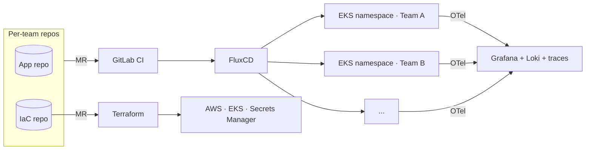

import TechStackGrid from '@site/src/components/TechStackGrid';

# Arctiq

**Role:** DevOps Consultant  
**Employer:** [Arctiq](https://www.arctiq.com/) (formerly Shadow-Soft, rebranded March 2026)  
**Since:** July 2022

<TechStackGrid
  caption="Main-engagement stack"
  items={[
    'AWS',
    'EKS',
    'Terraform',
    'FluxCD',
    'GitLab CI',
    'AWS Secrets Manager',
    'AWS Identity Center',
    'Entra ID',
    'OpenTelemetry',
    'Grafana',
    'Loki',
    'KubeCost',
    'Karpenter',
  ]}
/>

Arctiq is where I actually learned this work. They found my CV at PUCMM in April 2022, interviewed me out of Atlanta, decided I was worth investing in, and trained me on the DevOps side from the ground up — CI/CD, IaC, security, cloud, Linux — while paying for the certifications along the way. They put me on an engagement that is still my main one almost four years later, and I've taken on plenty of smaller work in parallel.

## The main engagement

When I joined, the client had 60+ applications and 15+ teams sharing them, with branch-per-team workflows that had been allowed to sprawl. Team A would have a branch on five of their own apps, but also three of Team B's apps and four of Team E's. Every branch ran as its own dedicated cloud instance with its own configuration and credentials. The result was five-to-eight times more deployed surface than the actual product needed, just to fit each team's workflow.

By the time I came in, an earlier assessment had migrated all of it to Rancher — but Rancher itself was running on manually-deployed EC2s, configured by hand in the AWS console, with namespaces multiplying as fast as branches. My original task was scoped narrowly: build CI pipelines so teams could deploy to the cluster automatically, and write IaC so the cluster could be reproduced.

I went further than the brief. I built a proof-of-concept arguing that since the client was already paying AWS, the platform should leverage it properly — a managed [EKS](https://aws.amazon.com/eks/) cluster, [FluxCD](https://fluxcd.io/) for continuous deployment, GitLab CI for the build half, and Terraform for the cloud underneath. The PoC made the case and the migration was approved.

### From manual Rancher to managed EKS

We migrated and consolidated as we went. Each team got one namespace for their apps, instead of the branch-per-team duplication. If Team B needed a change in a Team A app, the path was an MR in Team A's repo — not a fork-and-deploy in Team B's branch. That alone removed most of the 5–8x sprawl.

### Paying down the secrets debt

Once the platform was running on EKS, the next thing to fix was secrets. The cluster had been carrying every credential as a native Kubernetes secret. We ran proofs-of-concept against [HashiCorp Vault](https://www.vaultproject.io/) and [AKeyless](https://www.akeyless.io/), but landed on [AWS Secrets Manager](https://aws.amazon.com/secrets-manager/) — already in the account, already integrated with the IAM model we were standardizing on, and one fewer external dependency to maintain.

### Identity and access

I led the rollout of SSO-based access on the AWS side. [AWS Identity Center](https://aws.amazon.com/iam/identity-center/) now receives provisioned users from [Entra ID](https://www.microsoft.com/en-us/security/business/identity-access/microsoft-entra-id) — the org's main AD — and IAM users have been retired for people and systems alike. Everyone assumes a role. People assume theirs through PermissionSets defined per team scenario: developers scoped to their own app namespace with permission to manage their own secrets, read-only access where that's the right level, full admin where it's actually needed.

For automated workloads, GitLab CI agents authenticate against AWS through OIDC, so every pipeline run gets short-lived credentials instead of long-lived platform users sitting in a secrets store somewhere.

### Building observability from scratch

Monitoring started at zero. We brought in AWS CloudWatch alongside Grafana to cover the basics, then ran PoCs against Dynatrace and Datadog to see what enterprise vendors offered at the price point. The combination that won, on cost-effectiveness and on how cleanly it integrates with the rest of the platform, was **[OpenTelemetry](https://opentelemetry.io/) instrumenting the apps, with Grafana, [Loki](https://grafana.com/oss/loki/), and distributed traces on the receiving end**. Today every application has dashboards and alerts running through that stack.

### Terraform workshops for the dev teams

Once the IaC repos were in place, the next bottleneck was that the dev teams still treated infrastructure as something the DevOps team did for them. I've led several Terraform workshops to flip that pattern — teaching the dev teams to author their own resources, open MRs against the IaC repos, and own the result. Self-service via MR, reviewed by the platform team, instead of tickets routed through us.

### Where it's at now

The work today is consolidating what we built into something the client can run as a proper internal platform. We're formalizing the platform team, documenting the self-service tools and the expected developer workflow, and writing down our internal definitions for things that vary too much team to team. Cost and security are the two big themes of 2026 — [**KubeCost**](https://www.kubecost.com/) for cluster-level cost visibility, [**GuardDuty**](https://aws.amazon.com/guardduty/) and [**WAF**](https://aws.amazon.com/waf/) for the security perimeter, and [**Karpenter**](https://karpenter.sh/) coming up next for smarter node autoscaling.

## Other work at Shadow-Soft

The main engagement is the one I've been on the longest, but it's not the only thing I've done here.

- [**Icinga**](https://icinga.com/), on website and endpoint visibility for several other clients.
- [**Ansible**](https://www.ansible.com/), delivering automated OS-level solutions for clients whose work didn't need a full platform — just consistent, scripted server configuration.
- **Internal project and lab documentation** before the Arctiq acquisition — owning the central record of what the local team was building and how.

Around the same time, I got promoted internally to **local team mentor**. Not client-facing — a recognition of the help I'd been giving teammates on their own projects and certification exams: jumping on calls, sharing screens, drawing diagrams, explaining the same concept three different ways until it landed. I still spend time on that side of the work.

import AuthorCard from '@site/src/components/AuthorCard';

<AuthorCard />
