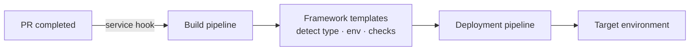

# FL Betances & Asociados

**Role:** DevOps Engineer  
**Employer:** [FL Betances & Asociados](https://flbetances.com/)  
**Client:** A banking institution  
**Dates:** June 2024 – December 2025

FL Betances placed me inside a banking institution's main DevOps team for eighteen months. The engagement was dense — fifty-plus teams across the bank, five hundred-plus open automation requests at any time, and a backlog that didn't shrink. Because it was a bank, every area was strictly segregated, which meant the DevOps team's scope was narrower than I'd seen elsewhere: pipelines, deployments, and the policy guardrails around both. The rest of the engineering stack belonged to other groups.

## The work

### The deployment framework

Most of the day-to-day was maintaining and extending an in-house deployment framework built on top of [Azure DevOps](https://azure.microsoft.com/en-us/products/devops). The flow ran on Azure DevOps service hooks: when a pull request completed, a hook fired a build pipeline that ran the framework's YAML templates against the changed project. The templates were the smart part — they were written to identify what kind of project they were looking at, infer where it should be deployed, decide which environment to target, and pick the right checks to run. Policy lived inside the framework templates.

### Night-shift on-call

Deployments at the bank ran at night — that was the deployment window across all fifty-plus teams — and I worked the night shift. Every team's overnight deploy went through me. When a deploy failed I'd trace the thread back through [ArgoCD](https://argo-cd.readthedocs.io/) and [AKS](https://learn.microsoft.com/en-us/azure/aks/) until I found where the policy or the template had snagged.

### Smaller pieces of the day

A few things lived alongside the framework. **[Power Automate](https://www.microsoft.com/en-us/power-platform/products/power-automate)** flows for the business-process automation that happens around DevOps work in a bank: approvals, notifications, ticket lifecycles. **ArgoCD and AKS debugging** when deployments failed in ways the framework couldn't catch on its own.

### The Terraform handoff

The last thing I worked on was an internal Terraform implementation: a library of pre-built modules teams could use to deploy cloud resources themselves. Modules and not raw resources, because that was the only way to enforce the variables and behaviour the bank's internal policies required. I led the implementation through most of the build, finished the modules and the patterns around them, and handed it off to the team almost complete. The handoff happened when my contract ended.

import AuthorCard from '@site/src/components/AuthorCard';

<AuthorCard />
