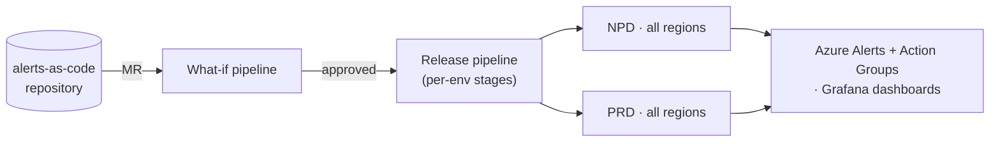

import TechStackGrid from '@site/src/components/TechStackGrid';

# INSPYR Global Solutions

**Role:** DevOps Engineer  
**Employer:** [INSPYR Global Solutions](https://www.inspyrsolutions.com/) (formerly Arroyo Consulting)  
**Since:** March 2025

<TechStackGrid
  caption="Platform stack"
  items={[
    'Azure',
    'AKS',
    'Bicep',
    'Azure DevOps',
    'GitHub',
    'PowerShell',
    'Grafana',
    'Databricks',
    'Synapse',
    'Cilium',
    'Key Vault',
  ]}
/>

I'm on a long-term engagement with one of the biggest Azure consumers in the world — the kind of customer that previews and recommends Azure features directly with the product team at Microsoft. The platform itself is 300+ services and microservices running across multiple regions on [AKS](https://learn.microsoft.com/en-us/azure/aks/), with releases driven by [Azure DevOps](https://azure.microsoft.com/en-us/products/devops) pipelines and PowerShell on the CI and scripting side. It could not have been any other language.

## What I work on

### Observability consolidation

When I joined, alerts and dashboards were scattered across environments, regions, and ownership models. I led the consolidation of all of it into one repository — a single source of truth — and a single release pipeline that deploys and reconciles every alert across NPD and PRD, every region, every alert type (metric, log), and every severity, with per-type handling rules baked in. Azure Alerts, Action Groups, and Grafana dashboards all flow through the same pipeline under GitOps practices. I'm one of two or three primary maintainers, and any drift gets reconciled on the next run.

### Bicep platform

The platform runs on [Bicep](https://learn.microsoft.com/en-us/azure/azure-resource-manager/bicep/overview). I didn't build the original solution, but I maintain it, extend it, and use it to deploy new services. We follow Microsoft's recommended layout of components, stacks, and `bicepparams`, with a what-if pipeline that runs on every MR (the Bicep analogue of `terraform plan`) and a dedicated deployment pipeline parameterized for the resource and the environment.

### Azure DevOps to GitHub Enterprise migration

The platform is moving from Azure DevOps to GitHub Enterprise. I was among the first engineers to develop CI pipelines and deploy new services on the GitHub side, which means a meaningful share of "what does a service's pipeline look like here" was settled in code I wrote.

### Data platform enablement

I've led two enablement engagements for developer teams that needed managed data infrastructure.

The first was [**Azure Synapse**](https://azure.microsoft.com/en-us/products/synapse-analytics/): workspace deployment plus a promotion model where notebooks and pipelines move from DEV through approval gates without the team having to touch infrastructure. All third-party credentials live in Azure Key Vault and connect over private endpoints.

The second was [**Databricks**](https://www.databricks.com/), with [Unity Catalog](https://www.databricks.com/product/unity-catalog) as the governance layer for permissions and connectivity into other Azure resources — the Databricks-recommended pattern. Both stacks are deployed entirely through Bicep, nothing manual, and I still own day-to-day support for both teams.

### Self-service data and operations portal

The biggest thing I'm leading right now grew out of that data-access problem. Developers needed to read from Azure SQL and MongoDB across environments, and the old path ran every query through an Azure DevOps pipeline — easy to get a parameter wrong, and before the pipeline existed it was a manual DevOps hand-off that burned hours on both sides.

The replacement is an internal web app. Developers run their queries directly and safely: production data comes back with PII masked, and anything hitting PRD waits on a dynamic approval queue where an admin is notified and can approve with a single click from their panel. The same app exposes gated Kubernetes operations — restart a workload, or change its resource requests, limits, or replica counts — so load-testing teams can drive their own performance runs. Every action is audited and gated by people accountable for it.

I'm leading the build and bringing leadership and other DevOps engineers onto it for the features that make it easier to manage and nicer to use. It's the strongest improvement we've shipped in this area, and the bet is that it becomes the standard that moves the group from DevOps toward a platform team.

### AKS to Cilium migration (in flight)

The platform is currently migrating off a number of public AKS clusters onto new ones running [Cilium](https://cilium.io/). The new clusters need to be wired into the 300+ apps' systems, networking, and permissions, which is not something one person can drive end-to-end. I'm soloing one of the environments — building the cluster, validating connectivity, and writing the smoke-check and deployment helpers that each app set runs through on the way over.

### Self-healing automation

A lot of older incident response on this platform involved manual remediation. Several tasks I've taken on have been mapping the failure points between services and turning the manual fix into a script — so when the same issue happens again the system handles itself, instead of a developer tagging the DevOps team to run the same fix one more time. The runbook ends up as code someone can read instead of memorize.

### Other work

A few smaller engagements I've been pulled into: a .NET performance project where I produced reports on long-running threads to identify improvements, and cross-team network troubleshooting where the symptom is "service A can't reach service B" and the actual answer lives somewhere between subnets, route tables, on-prem DNS servers, Microsoft-managed network hubs, and private hubs. The networking debugging in particular has been some of the most useful learning of the year.

import AuthorCard from '@site/src/components/AuthorCard';

<AuthorCard />
