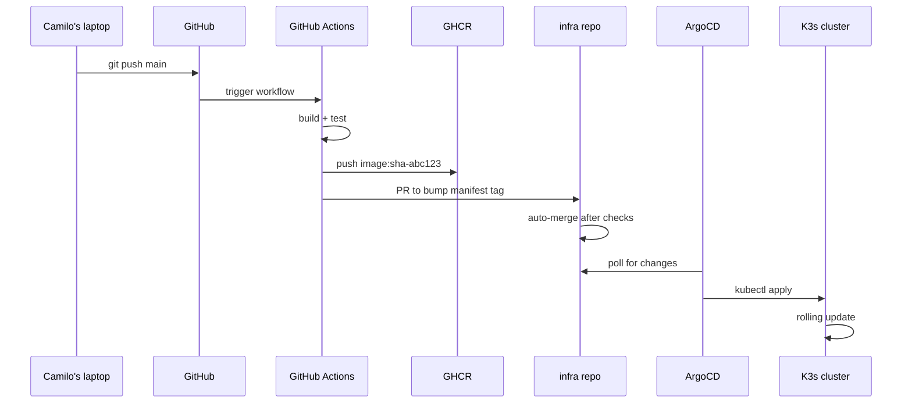
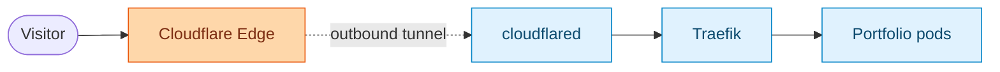

# Deployment

This is how a `git push origin main` ends up serving `cjoga.cloud` in roughly three minutes, without me touching a server.

## The pipeline



The whole loop completes in 2–4 minutes. Rollback is `git revert`. CI never gets cluster credentials.

## The Dockerfile

Multi-stage, ~140 MB final image:

```dockerfile title="Dockerfile"
# 1. Build the React frontend
FROM node:20-alpine AS frontend-build
WORKDIR /app
COPY package*.json ./
RUN npm ci
COPY . .
RUN npm run build

# 2. Runtime: Node + built assets only
FROM node:20-alpine
WORKDIR /app
COPY --from=frontend-build /app/dist ./dist
COPY server ./server
COPY package*.json ./
RUN npm ci --only=production
EXPOSE 80
CMD ["node", "server/index.js"]
```

## Kubernetes manifests

The deployment runs **2 replicas** with conservative resource constraints. The cluster has finite RAM and I want headroom.

```yaml title="kubernetes/portfolio.yaml"
apiVersion: apps/v1
kind: Deployment
metadata:
  name: portfolio-deploy
  namespace: web-development
spec:
  replicas: 2
  selector:
    matchLabels:
      app: portfolio
  template:
    metadata:
      labels:
        app: portfolio
    spec:
      containers:
        - name: portfolio
          image: ghcr.io/camilool8/portfolio:latest
          ports:
            - containerPort: 80
              name: http
          resources:
            limits:
              cpu: "0.5"
              memory: "512Mi"
            requests:
              cpu: "0.2"
              memory: "256Mi"
          readinessProbe:
            httpGet:
              path: /api/health
              port: http
            initialDelaySeconds: 10
            periodSeconds: 10
          env:
            - name: VITE_SUPABASE_URL
              valueFrom:
                secretKeyRef:
                  name: portfolio-secrets
                  key: supabase-url
---
apiVersion: v1
kind: Service
metadata:
  name: portfolio-svc
  namespace: web-development
spec:
  selector:
    app: portfolio
  ports:
    - protocol: TCP
      port: 80
      targetPort: http
```

Secrets are real `Secret` objects, created once via `kubectl create secret generic` and referenced by name. No env vars baked into images.

## Traefik routes everything

K3s ships Traefik. I keep it. The `IngressRoute` for the portfolio is twelve lines:

```yaml title="kubernetes/portfolio.yaml — ingress"
apiVersion: traefik.io/v1alpha1
kind: IngressRoute
metadata:
  name: portfolio-public-ingress
  namespace: web-development
spec:
  entryPoints: [web]
  routes:
    - match: Host(`cjoga.cloud`) || Host(`www.cjoga.cloud`)
      kind: Rule
      services:
        - name: portfolio-svc
          port: 80
```

Two domains, one rule. Traefik watches the API and reloads itself — I never restart it.

## Cloudflare Zero Trust: zero open ports

This is the part most homelabs get wrong by exposing port 443 with a sketchy port-forward.

A `cloudflared` deployment runs **inside** the cluster, opens an outbound tunnel to Cloudflare's edge, and that's the only ingress path.



My ISP-assigned IP is invisible. There is no `:443` listening anywhere on my home network.

```yaml title="kubernetes/cloudflared.yaml"
apiVersion: apps/v1
kind: Deployment
metadata:
  name: cloudflared
  namespace: cloudflare
spec:
  replicas: 2
  selector:
    matchLabels: { app: cloudflared }
  template:
    metadata:
      labels: { app: cloudflared }
    spec:
      containers:
        - name: cloudflared
          image: cloudflare/cloudflared:latest
          args:
            - tunnel
            - --no-autoupdate
            - run
            - --token
            - $(TUNNEL_TOKEN)
          env:
            - name: TUNNEL_TOKEN
              valueFrom:
                secretKeyRef:
                  name: cloudflare-tunnel
                  key: token
```

The tunnel is provisioned in the Cloudflare dashboard — public hostname `cjoga.cloud` maps to `http://traefik.kube-system.svc.cluster.local:80`. Cloudflare's edge handles:

- **TLS termination and cert rotation** (no Let's Encrypt cron in my life)
- **DDoS mitigation** at their network's edge, not mine
- **WAF rules** for bot blocking
- **Caching** for static assets

If my home internet drops, the tunnel goes red and Cloudflare serves a maintenance page from cache. My ASN never appears in a `dig` lookup.

:::warning[Run two `cloudflared` replicas]
A single replica is a SPOF — when its pod restarts, the site is unreachable for ~15 seconds. Two replicas split the load and one always survives a rolling restart. The token is reusable across replicas.
:::

:::info[What about Tailscale Funnel?]
Tailscale has its own outbound-tunnel-to-public-internet feature called Funnel. It works, but it's missing the CDN, WAF, and cache that Cloudflare gives you free. For a public site, Cloudflare is the right tool. For internal apps you want to share with a tailnet, Funnel is great.
:::

:::tip[Cloudflare cost]
Free tier covers all of this. Pro is $20/month and only buys nicer analytics and WAF tuning. I run free.
:::

## GitOps with ArgoCD

GitHub Actions builds the image and pushes a PR to a separate `infra/` repo bumping the manifest tag. ArgoCD watches that repo and applies.

<Tabs groupId="gitops">
  <TabItem value="why" label="Why split repos" default>
    **App repo** (`portfolio`) and **infra repo** (`infra`) are separate so CI never has cluster credentials. Image builds happen in CI; cluster applies happen in ArgoCD via a pull model. This is the GitOps contract: the cluster's state and the infra repo's `HEAD` are always equal.
  </TabItem>
  <TabItem value="manifest" label="ArgoCD Application">
    ```yaml title="argocd/portfolio-app.yaml"
    apiVersion: argoproj.io/v1alpha1
    kind: Application
    metadata:
      name: portfolio
      namespace: argocd
    spec:
      project: default
      source:
        repoURL: https://github.com/Camilool8/infra.git
        targetRevision: main
        path: clusters/homelab/web-development
      destination:
        server: https://kubernetes.default.svc
        namespace: web-development
      syncPolicy:
        automated:
          prune: true
          selfHeal: true
    ```
  </TabItem>
  <TabItem value="rollback" label="Rollback">
    ```bash
    # Roll back the live deploy by reverting the manifest commit
    cd infra
    git revert <bad-commit>
    git push
    # ArgoCD syncs within ~30 seconds
    ```
  </TabItem>
</Tabs>

## What's next

→ Continue to [**Going distributed**](/homelab/distributed) for what changed when the cluster outgrew a single room.
