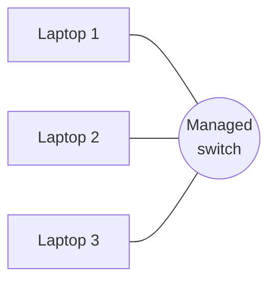
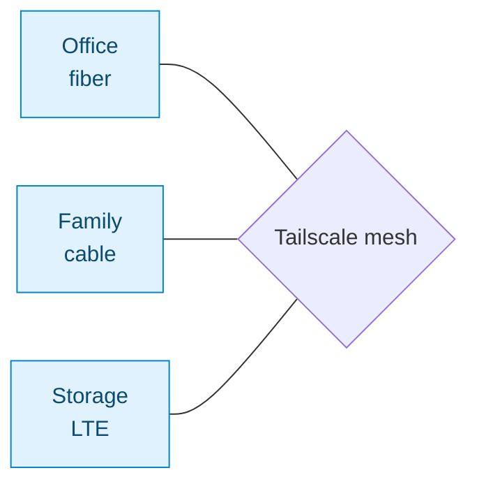
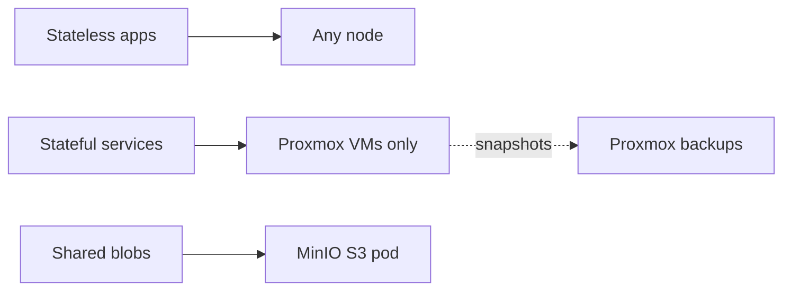

# Going distributed

Eight months after the initial cluster, the cluster doesn't live in one room anymore. Nodes are in my office, at a family member's house, and at a storage location entirely. There is no shared switch. There is no VLAN. They're on four different ISPs.

And it's **more reliable** than the original co-located setup ever was.

## The trigger: hardware luck

The shift wasn't planned — opportunity stacked up:

- A friend retired **two mini PCs** from his office and offered them to me
- I scored a **64 GB / i9 laptop** for cheap
- I already had the original 3 laptops

Suddenly I had ~7 nodes of compute, but they couldn't all share a switch. The choice was: leave the new hardware in a drawer, or figure out how to make a cluster work across networks.

I figured it out.

## What changed

**Before** — 3 laptops, one switch, one room:



**After** — 7 nodes, four ISPs, three locations, glued by Tailscale:



Same K3s control plane. Same manifests. The plumbing in between is what changed.

## Tailscale stopped being convenience and became the network

In the original setup, Tailscale was a convenience for `kubectl` from a coffee shop. In the new one, Tailscale **is** the cluster network. Every pod-to-pod packet rides a WireGuard tunnel.

Already covered in detail in [Networking](/homelab/networking). The flag that matters is `--flannel-iface tailscale0`.

## What broke and how I fixed it

### Problem 1 — DNS resolution across nodes

**Symptom**: pods on one node couldn't reach services on another. CoreDNS was up. Cluster-internal names resolved on the local node but not across the mesh.

**Root cause**: CoreDNS was binding to the wrong interface.

**Fix**:

```yaml title="kubectl -n kube-system edit configmap coredns"
.:53 {
    bind 100.x.x.10            # Tailscale IP of the master
    errors
    health { lameduck 5s }
    ready
    kubernetes cluster.local in-addr.arpa ip6.arpa {
       pods insecure
       fallthrough in-addr.arpa ip6.arpa
    }
    forward . /etc/resolv.conf
    cache 30
    loop
    reload
    loadbalance
}
```

Also pinned each node's `/etc/resolv.conf` to use the cluster's CoreDNS service IP as the primary resolver.

### Problem 2 — Storage across networks

**Symptom**: pods restarting on a different node lost their data. Local-path storage doesn't survive a reschedule.

**What I tried**:

| Option              | Outcome                                                      |
| ------------------- | ------------------------------------------------------------ |
| Longhorn            | Good, but replication traffic over Tailscale hurt on asymmetric residential uplinks |
| Rook/Ceph           | Way too heavy for 7 nodes                                    |
| OpenEBS             | Decent, but added complexity I didn't need yet               |
| **Hybrid approach** | What I shipped                                               |

The pragmatic split that works:



- **Stateless** → no PVCs, schedule anywhere
- **Stateful** → pinned to Proxmox VMs via `nodeSelector`, backed up via Proxmox snapshots
- **Shared blobs** → MinIO with an S3 API, single pod for now

Not elegant. Respects the bandwidth reality.

### Problem 3 — Probe timeouts

**Symptom**: pods flapping `Healthy` → `Unhealthy` → `Healthy` constantly. Kubernetes was killing perfectly fine pods.

**Root cause**: the original cluster's probes were tuned for a co-located network (2s timeout, 3s period). Across the mesh, an 80ms blip would tip them over.

**New defaults**:

```yaml
livenessProbe:
  httpGet: { path: /health, port: 80 }
  initialDelaySeconds: 30
  periodSeconds: 15
  timeoutSeconds: 10
  failureThreshold: 3
```

Pods stopped flapping the next deploy.

### Problem 4 — Proxmox VM machine IDs

**Symptom**: cloned VMs joined the cluster but K3s' certificate logic got confused.

**Root cause**: cloned VMs share a `machine-id`, which K3s uses as part of its identity hashing.

**Fix** (run once per fresh VM):

```bash
sudo rm /etc/machine-id /var/lib/dbus/machine-id
sudo systemd-machine-id-setup
sudo systemd-machine-id-setup --commit
```

## Spreading workloads across locations

The whole point of distributed is surviving a single-site outage. Pod anti-affinity makes Kubernetes do the right thing:

```yaml title="portfolio deployment — location anti-affinity"
affinity:
  podAntiAffinity:
    requiredDuringSchedulingIgnoredDuringExecution:
      - labelSelector:
          matchExpressions:
            - key: app
              operator: In
              values: [portfolio]
        topologyKey: location
```

Each node has a `location` label (`office`, `family`, `storage`). With two replicas, this guarantees they land in different locations. If my office loses internet, the family-location replica keeps serving.

## What this actually buys you

| Metric                  | Co-located (old) | Distributed (now) | Delta              |
| ----------------------- | ---------------- | ----------------- | ------------------ |
| Uptime                  | 99.2%            | 99.8%             | +0.6 pp            |
| Pod-to-pod p95 latency  | ~5 ms            | ~45 ms            | Worse (acceptable) |
| Edge TTFB (Cloudflare)  | ~80 ms           | ~80 ms            | Unchanged          |
| ISP failure tolerance   | no               | yes               | New capability     |
| Power outage tolerance  | no (whole site)  | yes (1 site)      | New capability     |

The latency hit is fine for everything I run. The resilience gain is enormous.

## What I'd do differently

1. **Embedded etcd from the start.** Single-server SQLite → HA migration is doable but annoying. `--cluster-init` is free insurance.
2. **Document Tailscale IPs immediately.** A simple table mapping `node-name → tailscale-ip → location → role` saves an hour every debugging session.
3. **Run chaos tests early.** Don't wait for a real outage to find out your probes are wrong. Disconnect a node on purpose. Watch what happens.
4. **Oversize the control plane.** The master VM does more work than you expect. 16 GB RAM is a floor, not a ceiling.

:::danger[You will get DNS wrong at least once]
Of all the things that broke building this out, the DNS issues were the worst — silent failures, intermittent reproductions, two-day debugging sessions. If your pods can't talk to each other across the mesh, suspect CoreDNS bindings before anything else. The fix is in this page.
:::

:::tip[Chaos engineering is free and worth it]
Once a quarter I disconnect a random node's Tailscale and watch what happens. The cluster always recovers. The exercise tells me the architecture works — and tells me when to update the runbook because something changed.
:::

## The point

Every "expensive enterprise" pattern — multi-region failover, mesh networking, GitOps, zero-trust ingress — is reachable from a closet, a $0 hardware budget, and a few weekends. The bottleneck is rarely the tools. It's the discipline to set them up properly.

The manifests, K3s configs, and ArgoCD setup are at [github.com/Camilool8](https://github.com/Camilool8). If you're trying something similar and get stuck on DNS at 1 am, email is on the [portfolio](https://cjoga.cloud).
