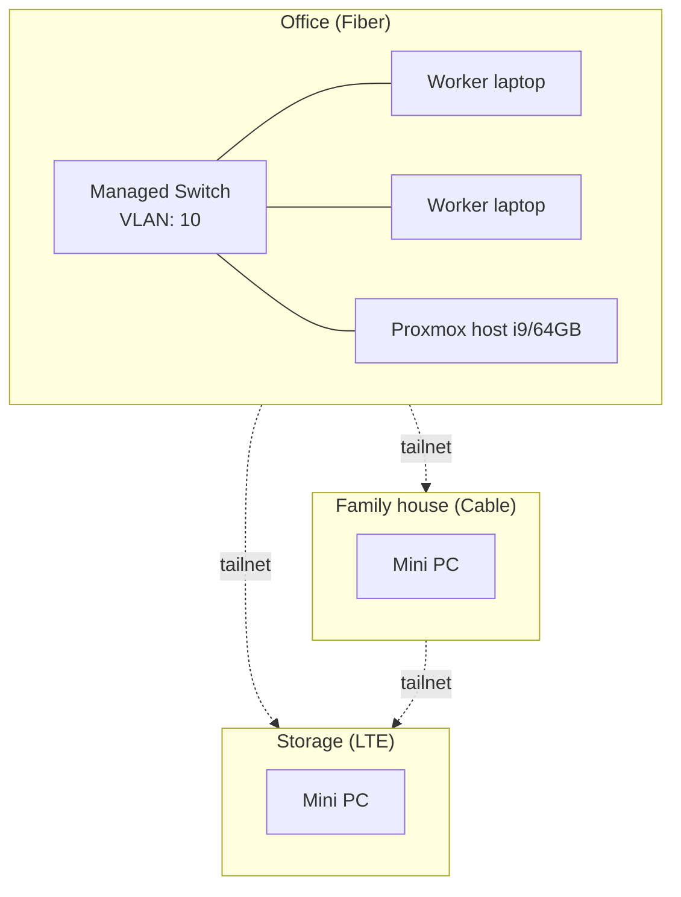

# Hardware

The total bill for everything that runs `cjoga.cloud` came in under **$400 new**, and most of it was free — repurposed laptops, gifted mini PCs. Below is the actual inventory.

## Current inventory

| Role               | Hardware                         | Location | Network | Cost (used)  |
| ------------------ | -------------------------------- | -------- | ------- | ------------ |
| Proxmox hypervisor | i9, 64 GB RAM, 1 TB NVMe         | Office   | Fiber   | ~$0 (lucky find) |
| ↳ VM 1             | 4 vCPU / 16 GB / K3s control plane | (same) | (same)  | —            |
| ↳ VM 2             | 3 vCPU / 12 GB / services        | (same)   | (same)  | —            |
| ↳ VM 3             | 2 vCPU / 8 GB / services         | (same)   | (same)  | —            |
| Worker laptop      | i5, 16 GB, 512 GB NVMe           | Office   | Fiber   | ~$120        |
| Worker laptop      | i5, 8 GB, 256 GB SATA SSD        | Office   | Fiber   | ~$90         |
| Worker mini PC     | i5, 8 GB, 256 GB SATA SSD        | Family   | Cable   | $0 (gifted)  |
| Worker mini PC     | i5, 8 GB, 256 GB SATA SSD        | Storage  | LTE     | $0 (gifted)  |
| Managed switch     | Gigabit, VLAN-capable            | Office   | —       | ~$50         |
| **Total**          |                                  |          |         | **~$260 + free hardware** |

## Why laptops

People ask this constantly. The answer:

:::tip[Battery = built-in UPS]
Laptops have a feature server hardware envies: **a battery**. When the power blips, the cluster keeps running for hours without any extra UPS. That's not a hack — it's the killer feature.
:::

They're also:

- **Energy efficient** — ~25 W idle vs 150 W+ for an equivalent server
- **Compact** — three nodes fit on a shelf
- **Self-contained** — networking, storage, compute, display, keyboard all in one package
- **Cheap on the used market** — i5 laptops with 8–16 GB RAM go for $80–120

The trade-off is **storage limits** (SATA SSDs over 512 GB get expensive) and **single-NIC networking**. Neither has been a problem in practice.

## OS choice

<Tabs groupId="os">
  <TabItem value="ubuntu" label="Ubuntu Server" default>
    All physical nodes run **Ubuntu Server 22.04 LTS**, minimal install, no GUI.

    ```bash
    # Disable lid-close suspend on laptops
    sudo sed -i 's/^#HandleLidSwitch=.*/HandleLidSwitch=ignore/' \
      /etc/systemd/logind.conf
    sudo systemctl restart systemd-logind
    ```
  </TabItem>
  <TabItem value="proxmox" label="Proxmox VE">
    The i9 laptop runs **Proxmox VE 8** on bare metal, with three Ubuntu Server 22.04 VMs on top.

    ```bash
    # In each VM after cloning, regenerate machine-id
    # so K3s doesn't get confused
    sudo rm /etc/machine-id /var/lib/dbus/machine-id
    sudo systemd-machine-id-setup
    sudo systemd-machine-id-setup --commit
    ```
  </TabItem>
</Tabs>

## Network topology



Office nodes share a managed switch on a dedicated VLAN, isolated from the household network. The two remote mini PCs ride on their respective home networks and join via Tailscale.

:::warning[Watch the network adapter]
Not every laptop's NIC plays nicely with VLAN tagging or sustained 1 Gbps throughput. Before committing, test with `iperf3` between two candidate nodes. I had to replace one of the original laptops because its NIC kept dropping packets above 400 Mbps.
:::

:::info[Storage growth strategy]
SATA SSDs over 1 TB get expensive used. If you expect to host databases or container registries on the cluster, plan to attach an external NVMe enclosure via USB-C on at least one node. I run my MinIO blob storage that way — $80 for 2 TB and it survives reboots fine.
:::

## What I'd buy if starting today

If I had $500 and wanted to replicate this, I'd skip laptops and buy three **Beelink Mini S** or similar mini PCs:

| Spec                | Beelink Mini S12 Pro          |
| ------------------- | ----------------------------- |
| CPU                 | Intel N100, 4 cores           |
| RAM                 | 16 GB DDR4                    |
| Storage             | 500 GB NVMe                   |
| Power draw          | 6 W idle / 25 W peak          |
| Price               | ~$170/unit new                |
| Total (3 nodes)     | **~$510**                     |

Three of these would outperform my current laptops, draw a quarter of the power, and fit in a shoebox. The only thing they'd lose is the laptop's battery — but at 6 W idle, even a cheap $80 UPS would carry them through hours of outage.

:::tip[Buy from the refurb market]
Beelink, Minisforum, and Geekom all sell certified refurbished units at 20–30% off MSRP. Same warranty, identical hardware. There's no reason to buy new for a homelab.
:::

:::danger[Do not put control-plane storage on a USB stick]
You will see tutorials suggesting it. Don't. K3s with etcd writes thousands of small files per minute and will eat through a USB flash drive in weeks. Always use the internal SSD or NVMe for `/var/lib/rancher`.
:::

## What's next

→ Continue to [**Networking**](/homelab/networking) for the Tailscale mesh setup.
