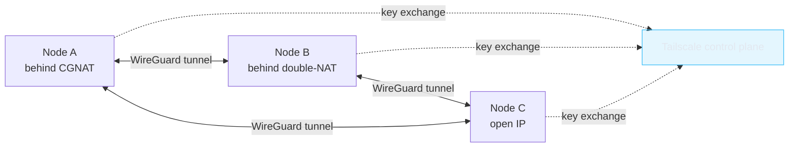

# Networking

The cluster's nodes don't share a switch. They don't share a network. They don't even share an ISP. Three of them are behind CGNAT. Yet they all behave as if they were on the same `192.168.1.0/24` subnet.

That's because the cluster network is **Tailscale**.

## What Tailscale gives you for free



| Capability               | Tailscale | WireGuard by hand |
| ------------------------ | --------- | ----------------- |
| WireGuard transport      | yes        | yes                |
| Key distribution         | yes        | DIY               |
| NAT/CGNAT traversal      | yes        | DIY (UDP hole punching) |
| MagicDNS for hostnames   | yes        | DIY               |
| ACLs and identity        | yes        | DIY               |
| MFA / SSO                | yes        | DIY               |
| Cost (under 100 devices) | $0        | $0 + your time    |

For a single-operator homelab, the "DIY" rows add up to a weekend you don't get back.

:::info[Why not OpenVPN or a self-hosted concentrator?]
Both work. Both centralize traffic through a gateway, which becomes a SPOF and a bandwidth bottleneck. Tailscale's mesh has no central hop — each peer talks directly to each other peer when NAT permits.
:::

## Installing the daemon

Run this on every cluster node (physical or VM):

```bash title="install + auth"
curl -fsSL https://tailscale.com/install.sh | sh
sudo tailscale up --ssh --accept-routes
```

The `--ssh` flag tells Tailscale to handle SSH auth via the tailnet (no more `~/.ssh/authorized_keys` shuffling). After the first `up`, the node gets a stable `100.x.y.z` address that follows it across networks.

## Stable hostnames via MagicDNS

Tailscale exposes nodes by hostname over a private DNS resolver. Once enabled in the tailnet admin panel:

```bash
# These work from any node in the tailnet
$ ssh k3s-master-vm1
$ ping worker-laptop-01.tail-scale.ts.net
$ kubectl --server=https://k3s-master-vm1:6443 get nodes
```

Cleaner than juggling IPs.

## The configuration that matters for Kubernetes

This is the flag that makes everything click:

```bash
--flannel-iface tailscale0
```

K3s uses Flannel as its default CNI. Tell Flannel to send pod-to-pod traffic over the `tailscale0` interface and you get:

- All cluster traffic encrypted in transit
- Pods on different ISPs can talk to each other directly
- No firewall rules to maintain

See [Kubernetes](/homelab/kubernetes) for the full bootstrap commands.

## Practical caveats

<Tabs groupId="caveats">
  <TabItem value="latency" label="Latency" default>
    Pod-to-pod p95 latency between cities lands around **30–50 ms** through Tailscale, plus whatever the underlying internet adds.

    For web workloads (HTTP requests, MQTT, gRPC with deadlines) that's fine. For latency-sensitive RPC (microservices doing 10+ sync calls per request), you'll feel it.
  </TabItem>
  <TabItem value="throughput" label="Throughput">
    Mesh throughput is limited by the slowest node's uplink. My LTE-connected mini PC tops out at ~15 Mbit/s, so anything that flows through it bottlenecks there. **Solution**: keep that node out of high-bandwidth paths via `nodeSelector`.
  </TabItem>
  <TabItem value="dns" label="DNS">
    MagicDNS conflicts with Kubernetes' CoreDNS unless configured carefully. CoreDNS needs to bind to the Tailscale interface explicitly — see [Going distributed](/homelab/distributed) for the ConfigMap I ended up with.
  </TabItem>
</Tabs>

## Cost

Tailscale's free tier covers up to **100 devices** and **3 users** per tailnet. The cluster uses 7 devices and 1 user. I've never paid them anything.

:::tip[Lock down with ACLs from day one]
Tailscale's ACL system is JSON-based and free on the personal tier. The default allows everything; you can tighten it so the cluster nodes only see each other and your laptop. [Their ACL docs](https://tailscale.com/kb/1018/acls) cover the syntax.
:::

:::warning[Don't run Tailscale on the host AND in pods]
A common mistake. The Tailscale daemon goes on the host (one binary per node). Pods reach the tailnet via the node's network namespace. Running `tailscaled` inside a pod creates split brain and lost packets.
:::

## What's next

→ Continue to [**Kubernetes (K3s)**](/homelab/kubernetes) for the cluster bootstrap.
