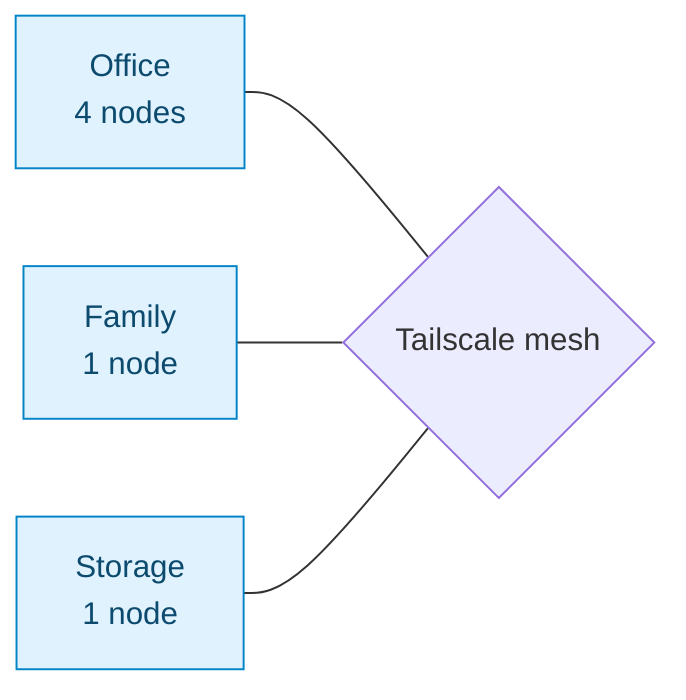

# Homelab overview

> When people hear "homelab," they usually picture a Raspberry Pi blinking in a closet. The cluster behind `cjoga.cloud` is something else.

This handbook is the field guide to the production-grade Kubernetes setup that serves this site. Every request you make hits real production tooling: a multi-node K3s cluster, a mesh VPN, GitOps deployments, and an outbound-only Cloudflare Zero Trust tunnel — running on hardware that cost less than one month of equivalent cloud hosting.

## What you'll find in this section

1. **[Hardware](/homelab/hardware)** — the three laptops, the i9 beast, the mini PCs, and what they cost
2. **[Networking](/homelab/networking)** — Tailscale mesh and why it became the cluster's nervous system
3. **[Kubernetes (K3s)](/homelab/kubernetes)** — bootstrapping, joining, and why K3s instead of full Kubernetes
4. **[Deployment](/homelab/deployment)** — Dockerfile, manifests, Traefik ingress, Cloudflare Zero Trust tunnels, GitOps
5. **[Going distributed](/homelab/distributed)** — when hardware luck pushed the cluster onto four ISPs across multiple locations

## The architecture, at a glance

A request to `cjoga.cloud` travels through three layers:

The cluster itself spans three physical locations stitched together by Tailscale:

Read [Hardware](/homelab/hardware) for the exact node inventory.

## The numbers

| Metric                  | Value                            |
| ----------------------- | -------------------------------- |
| Uptime (last 12 months) | **99.5%+** (mostly planned upgrades) |
| TTFB (North America)    | **~80 ms** at Cloudflare edge    |
| TTFB (Europe)           | **~140 ms**                      |
| Cluster nodes           | **7** (3 VMs + 4 physical)       |
| Networks spanned        | **4** different ISPs             |
| Monthly cost            | **~$20** (mostly electricity)    |
| Equivalent cloud cost   | **$200+/mo** before egress       |

:::tip[The real lesson]
The whole reason this works at all is **discipline, not budget**. Every "expensive enterprise" pattern — declarative manifests, GitOps, zero-trust ingress, mesh networking — is reachable from a closet, a $0 hardware budget, and a few weekends.
:::

:::info[Who this handbook is for]
You're comfortable on the command line, you know what Kubernetes is at a high level, and you want to build infrastructure that's actually useful — not toy demos. Each chapter assumes you can `ssh` into a Linux box and use `kubectl get pods` without panicking.
:::

:::warning[One thing to know up front]
This setup is not turnkey. You will hit DNS issues. A node will go offline at 2 am. A certificate will expire. The handbook documents what broke and how I fixed it — read [Going distributed](/homelab/distributed) before you commit to a multi-site setup.
:::

## Where to start

If you want to **copy the setup**, start at [Hardware](/homelab/hardware) and read straight through.

If you want to **understand the trade-offs**, jump to [Going distributed](/homelab/distributed) — that's where the real lessons live.

If you just want to **see the manifests**, they're at [github.com/Camilool8](https://github.com/Camilool8). Steal them.
