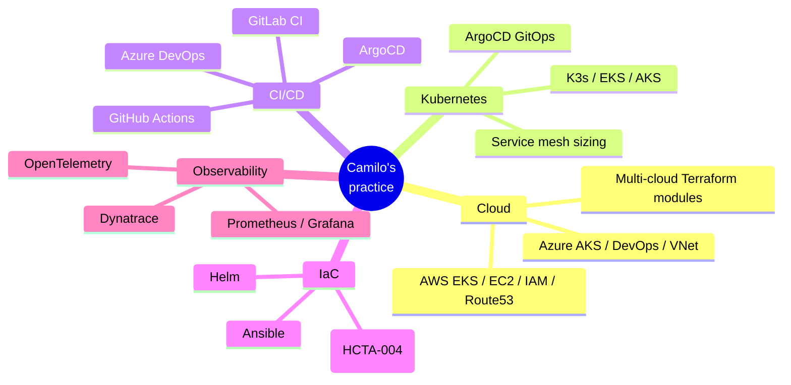

# Current engagements

I currently consult for two firms in parallel.

## Arroyo Consulting — DevOps Engineer (Mar 2025 – present)

End client: **Deloitte**. Working on cloud infrastructure modernization at enterprise scale.

**Tech surface area**: AWS, Terraform, Azure DevOps pipelines, Kubernetes (EKS).

## Shadow-Soft — DevOps Consultant (Jul 2022 – present)

End client: **W.W. Norton**. Long-running engagement on educational publishing platform infrastructure.

**Tech surface area**: GitLab CI, Kubernetes, Cloudflare, Tailscale (mesh networking for distributed teams), Dynatrace, Docusaurus (their internal guidebook).

## What I do, in general terms

## Case studies

Detailed case studies are coming soon — I'm in the process of getting client approval to publish anonymized versions.

:::info[In progress]
Want a specific case study faster? [Email me](mailto:josejoga.opx@gmail.com) and tell me what kind of problem you're trying to solve. I'll prioritize what's most useful.
:::

:::tip[How I scope engagements]
Most of my client work is delivered as **outcomes**, not hours — "migrate this workload to EKS by Q3" rather than "20 hours per week." If you're not sure what shape an engagement should take, I usually start with a paid 4-week scoping sprint that ends with a written delivery plan you can take to other vendors if you want.
:::

:::warning[Time-zone reality]
I'm in AST (Atlantic Standard Time, UTC-4). I can overlap with EST/EDT, CET mornings, and PST late afternoons. APAC clients work fine if you don't need synchronous-only collaboration.
:::

## Things I take on

- **Kubernetes migration** — from VMs to AKS/EKS, from EKS to K3s for cost reasons, from "we have no idea how this was deployed" to GitOps
- **CI/CD turnaround** — when pipelines take 2 hours and break weekly, I cut that to 15 minutes and stable
- **Terraform module design** — building reusable infrastructure libraries for teams that need them
- **Cloud cost optimization** — usually finds 30–50% savings on bills over $10k/month

Get in touch through the [portfolio](https://cjoga.cloud).
